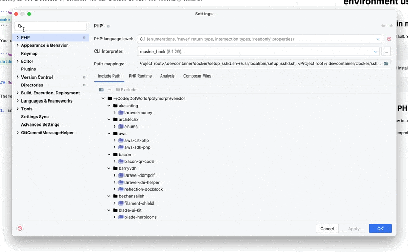
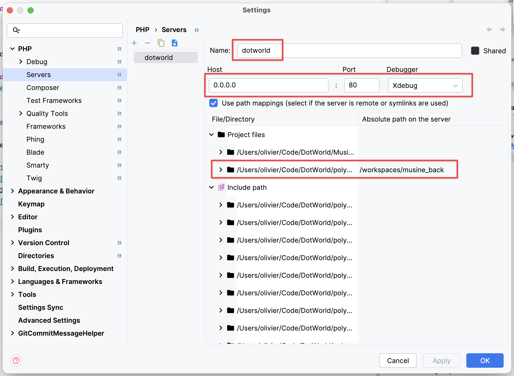
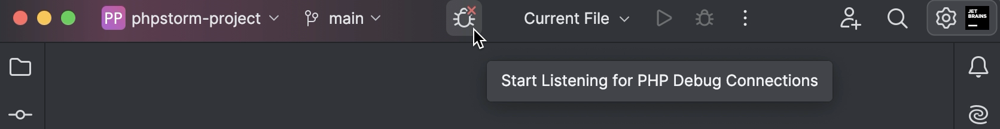

# Use Xdebug in your development environment using Docker

### Install Xdebug

Xdebug is not installed by default. Your container probably contains an installer, for instance:

```bash
dotdev
# then select Xdebug installation from the CLI prompt
```

or

```bash
./.devcontainer/customs/commands/xdebug.sh
```

## Use Xdebug in PHPStorm

There are some steps to follow to use Xdebug in PHPStorm:

1. Ensure you have a Cli interpreter linked to the container :  
     
2. Ensure you have a server setup with the Name 'dotworld' (notice the red blocs you need to fill):  
     
3. Enable/disable listening:  
     
4. Now you can use Xdebug in PHPStorm and you can debug your application. 🎉